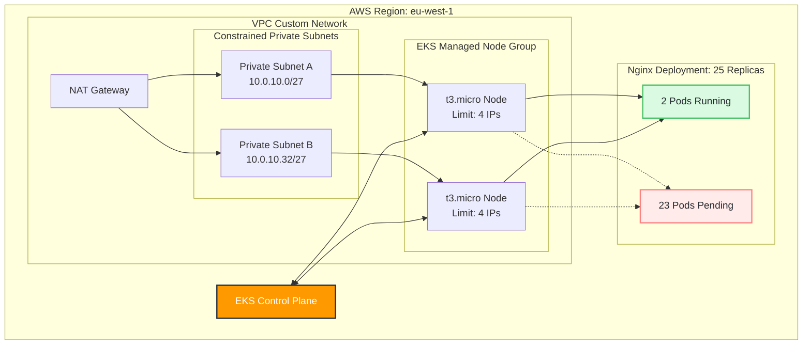

# EKS Network IP Exhaustion Simulation

This repository contains the infrastructure definitions and automation logic used to simulate, isolate, and detect network IP address exhaustion within an Amazon EKS cluster.

---

## Architecture Overview

The infrastructure deploys an EKS control plane and managed node group into a custom VPC with intentionally constrained private subnets.

By placing worker nodes inside small subnet ranges and using standard ENI allocation behavior, the environment quickly exhausts available pod IP addresses during workload scaling. This simulates a real-world network exhaustion scenario where pods fail scheduling despite compute and memory remaining available.

---

## Repository Structure

- **terraform/**  
  Contains the infrastructure configuration for:
  - VPC architecture
  - private subnets
  - route tables
  - security groups
  - EKS cluster resources

- **agent.py**  
  A standalone Python monitoring agent that:
  - watches Kubernetes scheduling events
  - detects IP exhaustion failures
  - identifies network capacity limits
  - triggers remediation workflows

---

## Simulation Steps

1. Provision the VPC and EKS infrastructure using the Terraform configuration.
2. Authenticate locally against the active EKS cluster endpoint.
3. Deploy and scale the workload to intentionally exhaust subnet IP capacity.
4. Run the monitoring agent to detect and analyze cluster scheduling failures.